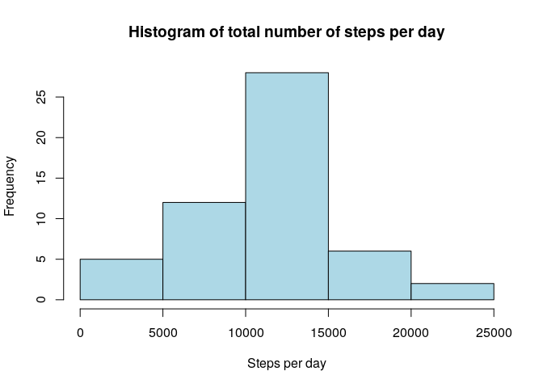
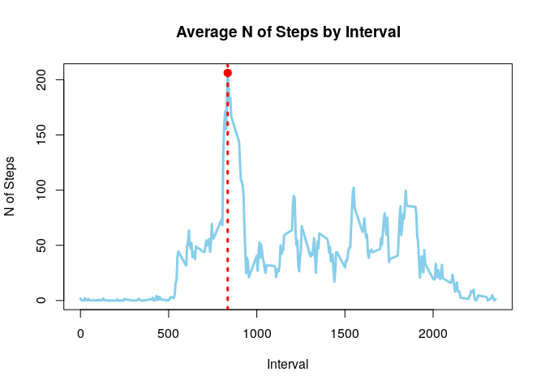
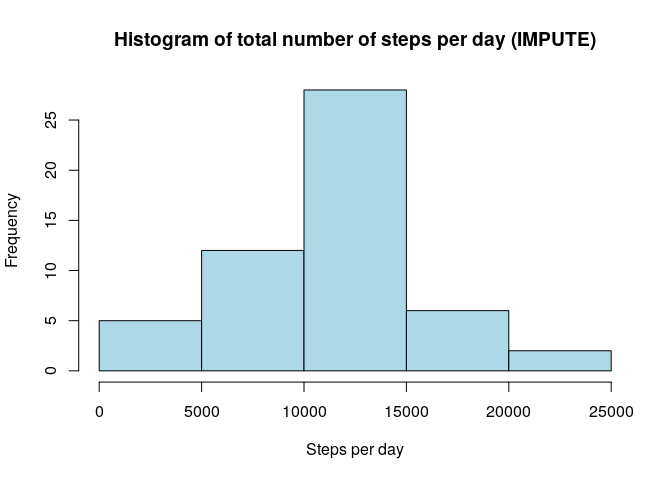
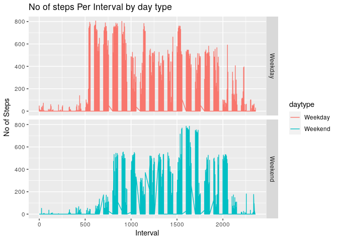
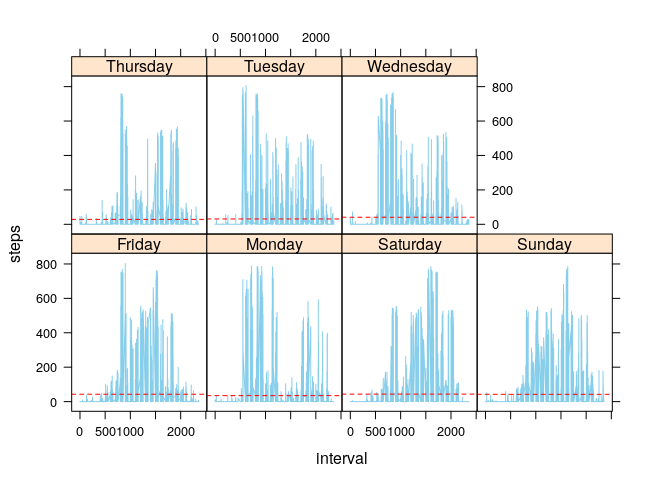

## Loading and preprocessing the data


```r
steps_table <- read.csv("activity.csv")
```

## Aggregation of Dataset


```r
daily_steps <- aggregate(steps~date + interval, steps_table, sum, na.rm = TRUE)
```

## What is mean total number of steps taken per day?


```r
steps_mean = mean(daily_steps$steps)
steps_median = median(daily_steps$steps)
```

* The **mean** total number of steps taken per day is 
    37.3825996 steps.
* The **median** total number of steps taken per day is 
    0 steps.
    
* Ploting Number of steps per day:


```r
daily_steps_num <- with(daily_steps, tapply(steps, as.factor(daily_steps$date), sum, na.rm = T))

hist(daily_steps_num, main = "Histogram of total number of steps per day", xlab = "Steps per day", col = "lightblue")
```

<!-- -->
    
* Aggregate Steps Interval


```r
steps_interval <- aggregate(steps~interval, steps_table, mean, na.rm = TRUE)
```

## What is the average daily activity pattern?


```r
steps_interval[which.max(steps_interval$steps),]$interval
```

```
## [1] 835
```

It is the **835th** interval.


```r
plot(steps_interval$interval, steps_interval$steps, type = 'l', col = "skyblue", lwd = 3, pch = 19, xlab = "Interval", ylab = "N of Steps", main = "Average N of Steps by Interval")
max_steps = steps_interval[which.max(steps_interval$steps), ]
points(max_steps$interval,  max_steps$steps, col = 'red', lwd = 3, pch = 19)
abline(v = max_steps$interval, col = 'red', lty = 3, lwd = 3)
```

<!-- -->

## Imputing missing values


```r
nrow(is.na(steps_table))
```

```
## [1] 17568
```

Total 17568 rows are missing.

## Handling missing values

We used the following function to filled all the missing values for correct interpretation and put it on a new frame.

Function:

```r
Int_Steps <- function(interval){
    steps_interval[steps_interval$interval==interval,]$steps
}
steps_filled <- steps_table
count = 0 
for(i in 1:nrow(steps_filled)){
    if(is.na(steps_filled[i,]$steps)){
        steps_table[i,]$steps <- Int_Steps(steps_filled[i,]$interval)
        count=count+1
    }
}
```

*Aggregating and Ploting:

```r
steps_filled_agg <- aggregate(steps~date, steps_filled, sum)
hist(steps_filled_agg$steps, main = "Histogram of total number of steps per day (IMPUTE)", xlab = "Steps per day", col = "lightblue")
```

<!-- -->

Total 2304 NA values were filled

## Are there differences in activity patterns between weekdays and weekends?

* Aggregation of the table


```r
steps_filled <- aggregate(steps~date + interval, steps_filled, sum)
```

* Daily Agregation to evaluate patterns between weekdays and weekends

We create a function to handle the weekend disgregation from the whole weekday group.

Function:

```r
weekpart = function(x){
    if(x %in% c('Saturday', 'Sunday')){
        return('Weekend')
    }
    
    return('Weekday')
}
```

Then we add these values to our table


```r
steps_filled$dayname = weekdays(as.Date(steps_filled$date))
steps_filled$daytype = as.factor(apply(as.matrix(steps_filled$dayname), 1, weekpart))
```

Plot the results:


```r
require(lattice)
```

```
## Loading required package: lattice
```

```r
require(ggplot2)
```

```
## Loading required package: ggplot2
```

```r
ggplot(steps_filled, aes(interval, steps)) +
    geom_line(stat = "identity", aes(colour = daytype)) +
    theme_gray() +
    facet_grid(daytype ~ ., scales="fixed", space="fixed") +
    labs(x="Interval", y=expression("No of Steps")) +
    ggtitle("No of steps Per Interval by day type")
```

<!-- -->

```r
xyplot(steps ~ interval | dayname, steps_filled, layout = c(4,2) , panel = function(x, y, ...) {
    panel.xyplot(x, y, type = "l", col = "skyblue")
    panel.abline(h = mean(y), lty = 2, col = "red")
})
```

<!-- -->
